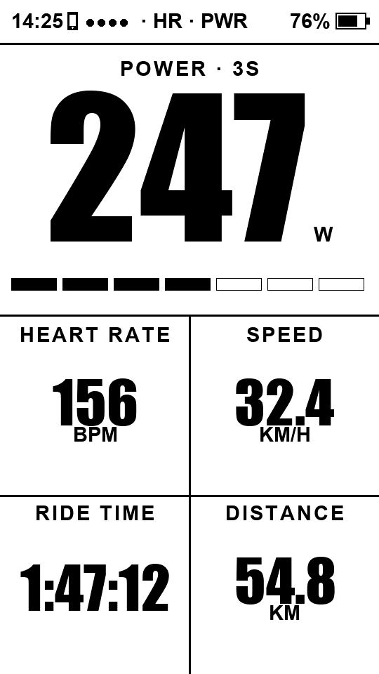
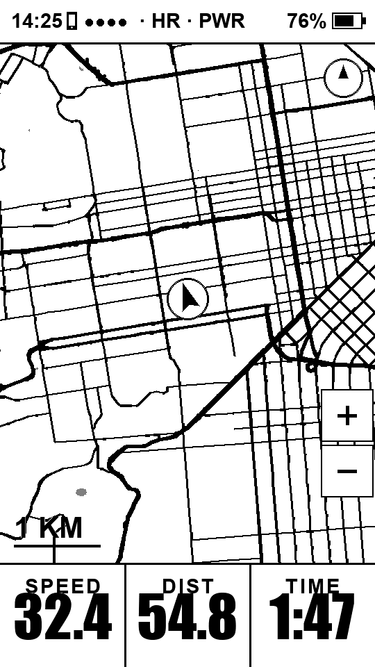
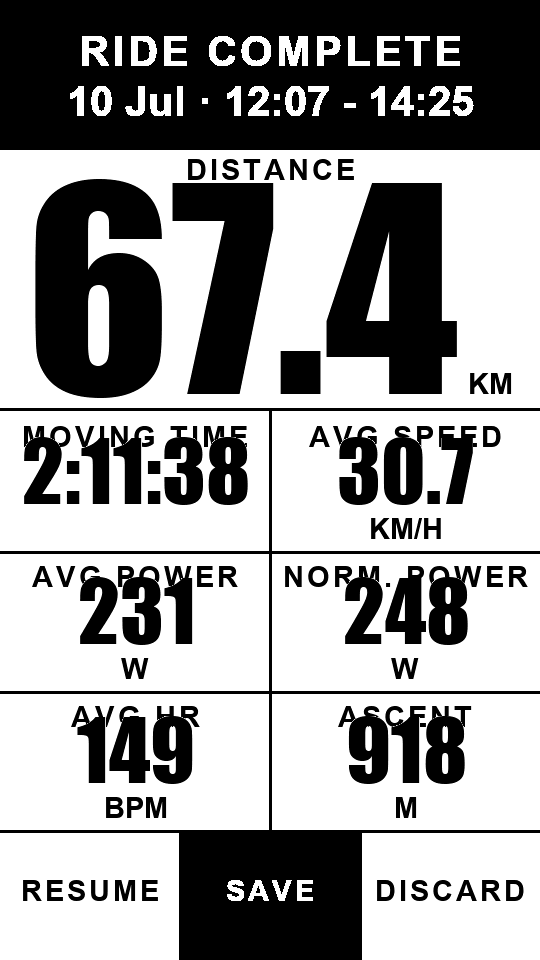
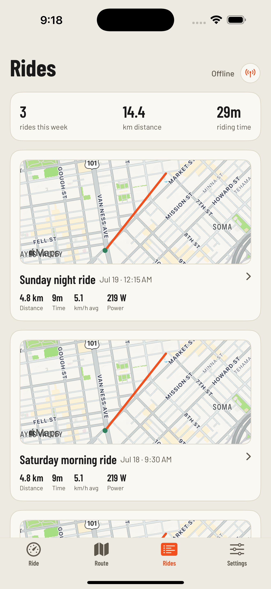
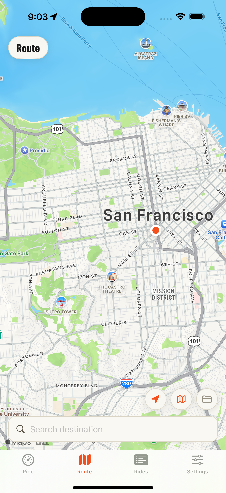
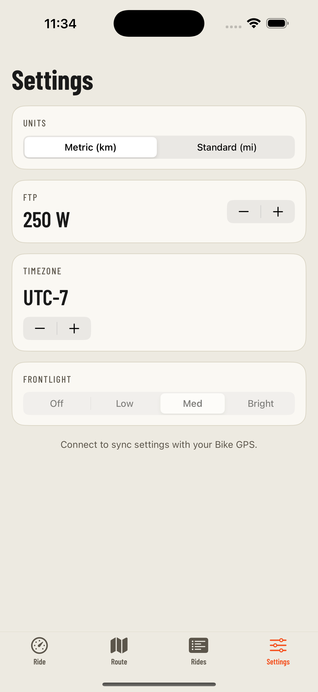

# OpenTrailPaper

[](https://github.com/RaemondBW/OpenTrailPaper/actions/workflows/build.yml)

OpenTrailPaper — a DIY e-paper bike GPS head unit for the [LilyGO T5S3 4.7" e-paper PRO](https://github.com/Xinyuan-LilyGO/T5S3-4.7-e-paper-PRO),
plus a SwiftUI iOS companion app for maps, routes and settings.

**[→ Project site](https://raemondbw.github.io/OpenTrailPaper/)** — feature tour
and an in-browser Web Serial firmware flasher (Chrome/Edge, no toolchain needed).
Source in [`docs/`](docs/).

The board has everything onboard: ESP32-S3 (16 MB flash / 8 MB PSRAM, BLE 5),
960×540 e-paper (driven in 540×960 portrait) with GT911 touch, GPS (u-blox
MIA-M10Q or L76K/CASIC — autodetected), SD card slot, PCF8563 RTC, BQ25896
charger and BQ27220 fuel gauge.

## Screens

**Device** — rendered by `src/ui_render.cpp` on the e-paper panel:

| Dashboard | Map (follows GPS) | Ride summary |
|:---:|:---:|:---:|
|  |  |  |

**iOS companion** — `companion-ios/`, four tabs (Ride / Route / Rides / Settings):

| Ride (live BLE status) | Route (plan + tiles) | Settings |
|:---:|:---:|:---:|
|  |  |  |

More device screens (menu, sensors, navigate, GPS debug, no-map, powered-off,
track-up, zoom levels) are in [`tools/preview/out/`](tools/preview/out/) —
regenerated on every UI change, see [Validating the device UI](#validating-the-device-ui).

## Phone / device split

The head unit is fully standalone — it records rides, navigates routes and
draws maps with no phone present. The companion app is the **authoring and
control surface**: anything awkward to do with a touch e-paper screen (typing a
destination, drawing a map region, editing settings, updating firmware) happens
on the phone and is pushed over BLE.

| | Device (ESP32-S3 firmware, `src/`) | iOS app (`companion-ios/`) |
|---|---|---|
| **Owns** | GPS, sensors, ride recording, rendering, navigation | Map tile authoring, route planning, ride history, settings UI, OTA |
| **Storage** | SD card (`/rides`, `/routes`, `/maps`, `/logs`) | transient — everything is streamed to/from the device |
| **Maps** | renders H3 tiles from the SD card | fetches OSM + elevation, builds tiles, streams them |
| **Routes** | rides a `/routes/*.gpx`, draws it on the map | Apple Maps search → GPX → BLE |
| **Settings** | source of truth, persisted in NVS | mirror + editor; the clock/USB/log/OTA controls appear once paired |
| **Firmware** | applies updates from SD or BLE | bundles `firmware.bin`, pushes OTA over BLE |

Everything the two sides exchange goes through the GATT server in
`src/ble_server.cpp` (mirrored by `companion-ios/Sources/BLEManager.swift`):
a **settings** characteristic (read/write, byte-for-byte mirrored),
a **status** notify stream (speed / battery / HR / power / sats / route
remaining), and framed **route**, **map-tile**, **log** and **OTA** transfers.

## Features

- **GPS** — position, speed, heading, altitude, satellites, UTC time
  (L76K/CASIC and u-blox M10Q autodetected; warm-start seeded with the
  last-known position, and optionally the phone's location as a fallback).
- **BLE sensors** — heart rate, cycling power (incl. cadence from crank data),
  speed/cadence. Pair from the Sensors screen; pairings persist in flash.
- **Ride recording** — 1 Hz FIT files on the SD card (`/rides/*.fit`),
  uploadable to Strava / intervals.icu. Moving time, avg/normalized power,
  avg HR and climbing tracked for the summary (SAVE / DISCARD). Rides cut short
  by a crash or dead battery are repaired on the next boot.
- **Offline maps** — H3 hexagonal tiles on the SD card, authored on the phone
  or by `tools/maps/build_map.py`. 1-bit rendering, zoom 1–8 m/px, follows GPS,
  optional track-up rotation. See [Map tiles](#map-tiles).
- **Map-cached elevation** — altitude and climb come from a DEM grid baked into
  each map tile, not the GPS chip's noisy barometric/ellipsoidal altitude.
- **GPX routes** — plan on the phone or drop `.gpx` in `/routes`; pick one under
  Navigate. Route draws on the map (ridden solid / ahead dashed) with
  km-remaining in the footer and optional turn banners.
- **On-device settings** — units (mi/km), 12/24 h clock, FTP (power zone bar),
  timezone, frontlight level, USB drive on/off — persisted in NVS, mirrored to
  the app.
- **Updates** — drop `firmware.bin` on the SD card, or push it over BLE from the
  app (A/B OTA partitions protect the running image either way).

### Controls

- Tap the status bar → menu; tap elsewhere → dashboard ↔ map
- Long-press (1.2 s) → start / stop ride
- Map: +/− buttons zoom

## Map tiles

Maps are stored as small per-cell binaries on the SD card, one file per
[Uber H3](https://h3geo.org/) **resolution-6 hexagon** (~36 km² each, ~3–4 km
across). Hexagons tile the plane without the seams/overlap of a lat/lon square
grid, and each cell is a stable global id, so a tile is downloaded once and
reused forever.

```
/maps/tiles/<h3id>.ebm     one hexagonal tile (vector roads + elevation grid)
/maps/<name>.ebm           optional legacy whole-region blob (fallback)
```

### Tile format (`EBM1` + `ELV1`, little-endian)

Each tile is a self-contained blob carrying its own grid header:

```
magic 'EBM1'
f64   lat0, lon0        tile SW origin (deg)
f64   tileDeg           tile size (deg)
i32   nx, ny            sub-grid dimensions
u32[2] index[nx*ny]     (offset, length) per sub-tile
polylines:
  u8  class             0 major road · 1 minor road · 2 path · 3 rail
  u16 pointCount
  i16 x, y per point    metres east/north of the tile SW corner
── appended elevation block ──
magic 'ELV1'
i32   gw, gh            elevation grid dims (~20×20, ≈350 m spacing)
f64   s, w, n, e        grid bounds
i16   elevation[gw*gh]  metres
```

Roads are classified into 4 render classes that map to line widths/dash styles;
geometry is simplified and delta-encoded as 16-bit metre offsets to keep tiles
tiny. Parsing/projection lives in `src/map_tiles.cpp`.

### Three ways to create tiles

**1. On the phone (primary).** In the Route tab, draw a box over the area you
want. The app (`companion-ios/Sources/`):

1. `H3Tiles.coveringTiles()` computes every res-6 hexagon overlapping the box
   (you can deselect individual hexes before downloading).
2. For each hex, `MapBuilder` fetches OSM ways from Overpass (multiple
   endpoints with retry + rate-limit handling), classifies and simplifies them,
   and encodes an `EBM1` blob.
3. It fetches a `gw×gh` elevation grid from [Open-Meteo](https://open-meteo.com/)
   and appends the `ELV1` block.
4. The tile streams to the device over BLE; the firmware writes it to
   `/maps/tiles/<h3id>.ebm`. Downloads run in parallel, already-present tiles
   are skipped, and finished hexes fill in green live on the map.

**2. On the desktop (region bake).** `tools/maps/build_map.py` fetches Overpass
for a bounding box, clips it into a square grid, and writes a single `EBM1`
file you copy to `/maps/` — the legacy whole-map fallback used where no H3 tile
covers the rider. See [`tools/README.md`](tools/README.md).

**3. In the browser (region bake, no toolchain).** The
[project site](https://raemondbw.github.io/OpenTrailPaper/#maps) has a
*Generate an offline map* section: pick a bounding box on a map, and it fetches
Overpass and encodes the same whole-region `EBM1` blob as `build_map.py`
entirely client-side, then hands you a `<name>.ebm` to drop in `/maps/`. It's a
JS port of `build_map.py` (`docs/mapgen.js`) — byte-for-byte identical output.
No elevation grid (that's the phone's per-hex path), so it's the whole-map
fallback layer, not the primary tile layer.

### On-device handling

`src/map_store.cpp` keeps a lightweight in-memory index of every
`/maps/tiles/*.ebm` (`h3id` + bounding box). To draw a frame it projects **all**
tiles overlapping the current view through a rider-centred equirectangular
transform, backed by a 20-tile LRU cache in PSRAM. Elevation for the current
position is read from the covering tile's `ELV1` grid. Where nothing covers the
rider it falls back to a whole-map blob, and if there is no map at all it shows
a **NO MAP HERE** screen rather than a blank panel.

## Validating the device UI

The e-paper renderer is compiled and run **on macOS** so every screen can be
checked without flashing hardware. `tools/preview/render_preview.sh`:

- compiles the **real** drawing code — `src/ui_render.cpp`, `src/map_view.cpp`,
  `src/map_tiles.cpp` — against the **real** epdiy font/drawing library, with
  only the hardware layer (display, GPIO, GPS) stubbed;
- renders each screen (dashboard, map at several zooms, summary, menu, sensors,
  navigate, settings, GPS debug, no-map, powered-off, nav banners) into
  `tools/preview/out/*.png`, **pixel-identical to the panel**.

```sh
sh tools/preview/render_preview.sh   # writes tools/preview/out/*.png
```

Because it's the actual font metrics and layout code, this is where text
overlap, clipping and alignment bugs are caught **before** a build — always
regenerate and eyeball the previews after any UI change. The screenshots in
this README come straight from this tool.

## FIT encoder tests

`tools/fit_test/run_fit_test.sh` compiles the real `src/fit_writer.cpp` against
a small FS shim and writes sample rides to `tools/fit_test/out/` — including a
ride cut short by a reset, to cover the boot-time recovery path. With
[fitdecode](https://pypi.org/project/fitdecode/) installed
(`pip install fitdecode`) it parses each file with CRC checking, which catches
encoder bugs an upload would otherwise reject.

Both host harnesses plus a full firmware + iOS build run in CI
(`.github/workflows/build.yml`).

## Building

### Firmware

Requires [PlatformIO](https://platformio.org/) and the vendored LilyGO repo
(board definition + display/touch/battery drivers):

```sh
git clone --depth 1 https://github.com/Xinyuan-LilyGO/T5S3-4.7-e-paper-PRO \
    vendor/T5S3-4.7-e-paper-PRO         # if missing
pio run                                 # build
pio run -t upload                       # flash over USB
pio device monitor -b 115200            # serial log
```

The board runs in USB-OTG mode, so esptool's auto-reset can't enter the
bootloader: to flash, hold **BOOT**, tap **RESET**, release **BOOT** (the port
enumerates as `…usbmodem2101`), upload, then tap **RESET** to run. Alternatively
copy `firmware.bin` to the SD card root and reboot, or push OTA from the app.

No toolchain? Flash a prebuilt `firmware.bin` (from CI artifacts or a release)
straight from the [project site](https://raemondbw.github.io/OpenTrailPaper/#flash)
over Web Serial in Chrome/Edge — same manual download-mode step as above.

### iOS companion

Requires Xcode 16+ and [XcodeGen](https://github.com/yonaskolb/XcodeGen)
(`brew install xcodegen`):

```sh
cd companion-ios
xcodegen generate            # produces BikeGPSCompanion.xcodeproj
open BikeGPSCompanion.xcodeproj
```

Set your development team in Signing, then run on a real iPhone (BLE needs
hardware; the simulator has no Bluetooth). The app auto-scans for the `BikeGPS`
peripheral on launch. `companion-ios/Sources/firmware.bin` is the OTA payload
and must match `src/config.h`'s `FIRMWARE_VERSION`.

## SD card layout

```
/rides/YYYYMMDD-HHMMSS.fit   ride recordings (UTC timestamps)
/routes/*.gpx                routes for the Navigate screen
/maps/tiles/<h3id>.ebm       H3 hexagonal map tiles
/maps/*.ebm                  optional whole-region fallback maps
/logs/YYYYMMDD.log           per-day diagnostic logs
/firmware.bin                dropped here → flashed on next boot
```

## Source layout

```
src/
  main.cpp           task startup, IO expander (GPS/LoRa power), fuel gauge
  config.h           pin map + tunables + FIRMWARE_VERSION
  ride_state.h       mutex-guarded shared state (GPS/BLE/battery → UI/recorder)
  gps_service.*      L76K/CASIC + M10Q autodetect, aiding, TinyGPSPlus → state
  ble_sensors.*      NimBLE central: HR / power / CSC parsing
  ble_server.*       NimBLE GATT server: settings, status, route/tile/log/OTA
  fit_writer.*       minimal FIT activity encoder + interrupted-ride repair
  ride_recorder.*    ride lifecycle, distance, SD writes, boot recovery
  map_store.*        SD tile index, LRU cache, elevation lookup, save/rescan
  map_tiles.*        EBM1/ELV1 parsing + projection
  map_view.*         map + route drawing
  ui_render.*        all screen layouts (host-compilable)
  ui_dashboard.*     epdiy frame loop + GT911 touch + SD firmware update
  usb_storage.*      USB mass-storage: SD as a drive, host/device arbitration
  settings.*         NVS-backed settings
  diag.*             per-day SD logging + crash backtraces
companion-ios/
  Sources/           SwiftUI app: Ride / Route / Settings, BLE, map authoring
  Sources/H3/        Uber H3 v4.1.0 (vendored) + thin C shim
tools/
  preview/           host renderer for the device screens (→ out/*.png)
  fit_test/          host FIT encoder + CRC validation
  maps/              OSM → EBM1 region map builder
vendor/              LilyGO board support (cloned, not committed)
```
