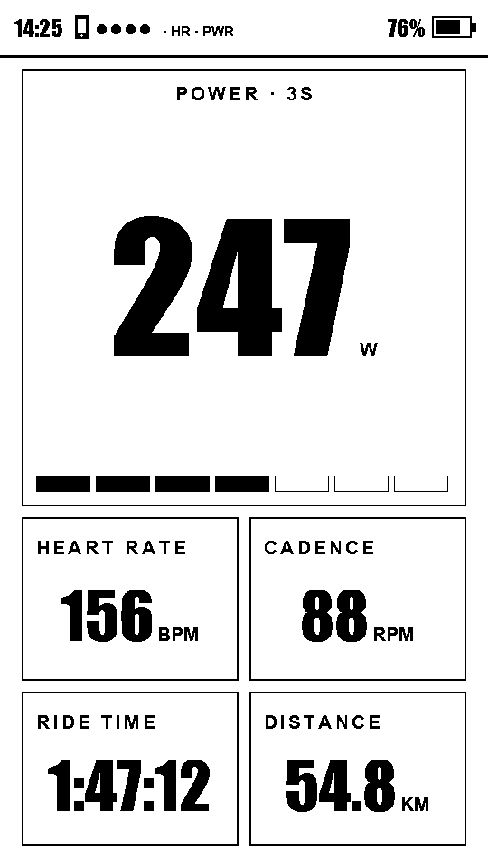
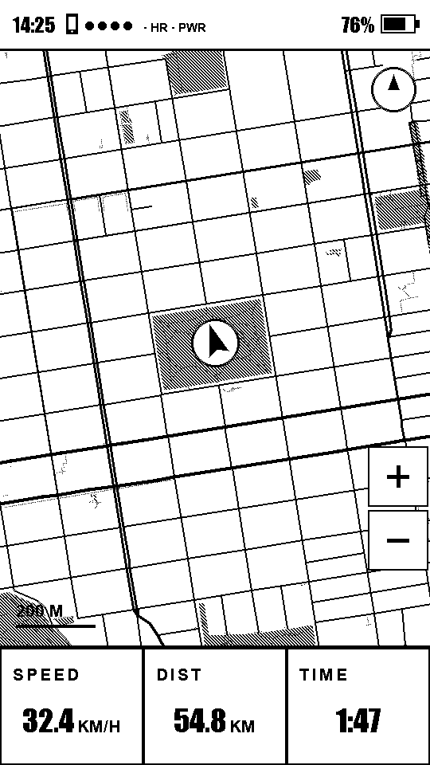
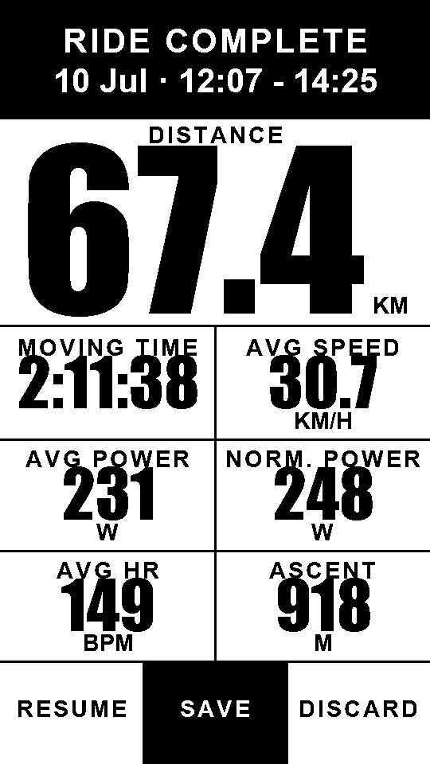
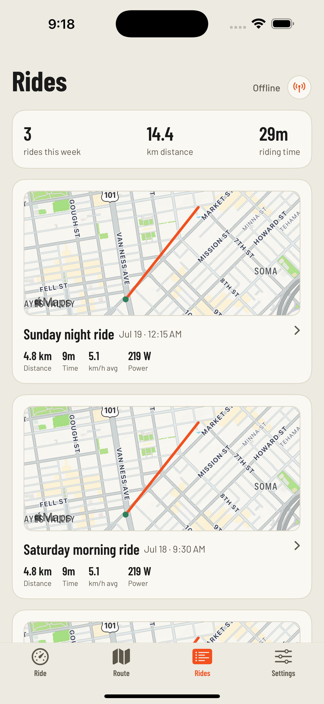
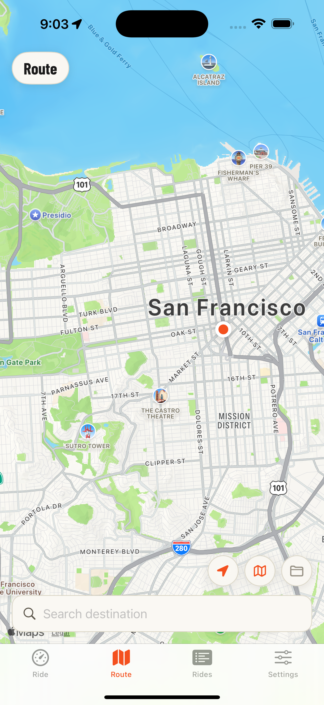
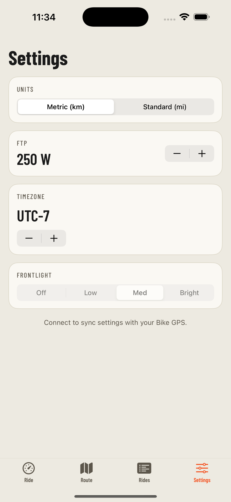

# OpenTrailPaper

[](https://github.com/RaemondBW/OpenTrailPaper/actions/workflows/build.yml)

OpenTrailPaper — a DIY e-paper bike GPS head unit for the [LilyGO T5S3 4.7" e-paper PRO](https://github.com/Xinyuan-LilyGO/T5S3-4.7-e-paper-PRO),
plus a SwiftUI iOS companion app for maps, routes and settings.

**[→ Project site](https://raemondbw.github.io/OpenTrailPaper/)** — feature tour
and an in-browser Web Serial firmware flasher (Chrome/Edge, no toolchain needed).
Source in [`docs/`](docs/).

The board has everything onboard: ESP32-S3 (16 MB flash / 8 MB PSRAM, BLE 5),
960×540 e-paper (driven in 540×960 portrait) with GT911 touch, GPS (u-blox
MIA-M10Q or L76K/CASIC — autodetected), SD card slot, PCF8563 RTC, BQ25896
charger and BQ27220 fuel gauge.

## Hardware

### Reference board

The reference hardware is the **LilyGO T5S3 4.7" e-paper PRO** — everything is
onboard, nothing to wire. The firmware targets it directly, but the
hardware-specific pieces are small and isolated, so alternative boards are
intended to be supportable.

### Supporting other boards

A candidate board needs, at minimum:

- **ESP32-S3 with PSRAM.** The map tiles, elevation grids and the two 540×960
  framebuffers live in PSRAM — an S3 without PSRAM (or a plain ESP32) won't fit.
- **A supported e-paper panel.** Drawing goes through `src/epd_compat.*`, which
  has two backends: **EPD_Painter** (the shipping one — `pio run`) and
  [epdiy](https://github.com/vroland/epdiy) (`pio run -e t5s3-pro`), so a panel
  needs a board definition for whichever you use. The layout assumes ~4.7" /
  960×540; a different size means reworking `src/ui_render.cpp`.
- **A UART GPS.** Any NMEA receiver works; u-blox M10 and CASIC additionally get
  a binary warm-start path (see below).
- **An SD card on SPI** — all maps, rides, routes and logs live there.
- **BLE** — the companion-app link (built into the ESP32-S3).
- **At least one button** for start/stop and menu. Touch is used but optional.

Porting is mostly re-pointing three things:

- [`src/config.h`](src/config.h) — every GPIO (GPS UART, shared I²C, SD SPI,
  buttons, backlight) and the display rotation.
- `src/board_power.*` — power rails and sleep. On the reference board the
  **GPS 3V3 rail is gated behind pin 0 of the XL9555 I²C expander**, so the
  receiver stays dark until that's switched on — an easy thing to miss on a port.
- The panel definition (via `platformio.ini`) — how the display is driven.

The non-essential peripherals (RTC, fuel gauge, charger, frontlight) degrade
gracefully if a board lacks them.

### Elevation without a barometer

The board has **no pressure sensor**, and the GPS chip's own altitude
(geometric, no barometric aiding) is far too noisy to derive climb from — tens
of metres of jitter while standing still. So the device ignores GPS altitude
entirely.

Instead, **elevation is baked into the map tiles.** When the app builds a tile it
also fetches a coarse DEM (digital elevation model) for that area from
[Open-Meteo](https://open-meteo.com/) and appends it as an `ELV1` block (~20×20
samples, ≈350 m spacing — see [Tile format](#tile-format-ebm2--elv1--wtr2--prk2-little-endian)).
At runtime the device reads its altitude by bilinearly interpolating that grid at
the current GPS position and accumulates climb from it — a smooth, real elevation
profile that needs only a horizontal fix. The trade-off: elevation exists only
where you've downloaded tiles.

### GPS cold-start seeding

A receiver that has no idea where or when it is — a **cold start**, on first
power-on or after its almanac goes stale — can take **many minutes** to fix: it
blindly searches the whole sky. Two things cut that down:

- **Warm start from the last fix.** The device persists its last position and the
  RTC holds time across sleep, so on wake it already has a rough where/when to
  seed the receiver — most starts become warm starts (seconds, not minutes).
- **Phone-seeded start.** While connected, the companion app streams the phone's
  location to the device every few seconds. When the device has no fix it injects
  that position and time as an aiding message — **CASIC `AID-INI`** or a **u-blox
  `UBX` aiding frame** depending on the detected chip (see
  [`src/gps_service.cpp`](src/gps_service.cpp)) — so the receiver knows where to
  look and locks on fast. The phone location also stands in as the map position
  until the device's own fix lands.

### Where better hardware would help

The reference board works well, but a few of its choices are compromises the
firmware works around. A future revision — or a custom board — could improve on
them:

- **A pressure sensor (barometric altimeter).** Elevation today comes entirely
  from map-baked DEM tiles (see
  [Elevation without a barometer](#elevation-without-a-barometer)): smooth and
  accurate, but it only exists where you've downloaded tiles, it can't sense
  short local features (an overpass, a parking-garage ramp), and it can't work
  off the grid at all. A cheap I²C barometer (BMP390, DPS310, …) would give
  real-time relative altitude *anywhere*. The ideal is to fuse the two — the DEM
  as an absolute reference, the barometer for fine changes and for filling gaps
  where no tile is loaded — plus a live vertical-speed / grade readout. It hangs
  off the existing I²C bus, so it's a small add.

- **ANT+ alongside BLE.** Sensor pairing is BLE-only. Plenty of cycling gear —
  especially older heart-rate straps and power meters — speaks ANT+ (or both).
  The ESP32-S3 has no ANT+ radio, so this needs an add-on: an ANT transceiver on
  UART/SPI (e.g. an nRF52 running the ANT stack) or a Garmin ANT+ USB stick. It
  would broaden sensor compatibility at the cost of a second radio and its power.

- **A bigger battery.** The reference board's onboard cell is modest, so runtime
  is the main limit on long / multi-day rides. The e-paper only draws power on
  refresh, so the battery is the biggest lever on total ride time — and the
  firmware already logs fuel-gauge drain (SoC, voltage, current, capacity), so
  the effect of a larger cell is directly measurable.

- **Dedicated GPIO buttons.** The buttons sit on awkward pins. The main button is
  **GPIO0**, the ESP32 strapping / download-mode pin — it doubles as the sole
  deep-sleep (`ext0`) wake source and is shared with the bootloader. The side
  button hangs off the **XL9555 I²C expander (PC12)**, which can't wake the chip
  from deep sleep directly — its interrupt has to be routed through a GPIO.
  Wiring the buttons to plain, wake-capable GPIOs would give cleaner input,
  independent wake sources, and free GPIO0 from double duty.

## Screens

**Device** — rendered by `src/ui_render.cpp` on the e-paper panel:

| Dashboard | Map (follows GPS) | Ride summary |
|:---:|:---:|:---:|
|  |  |  |

**iOS companion** — `companion-ios/`, four tabs (Ride / Route / Rides / Settings):

| Ride (live BLE status) | Route (plan + send) | Settings |
|:---:|:---:|:---:|
|  |  |  |

More device screens (menu, sensors, navigate, GPS debug, no-map, powered-off,
track-up, zoom levels) are in [`tools/preview/out/`](tools/preview/out/) —
regenerated on every UI change, see [Validating the device UI](#validating-the-device-ui).

## Phone / device split

The head unit is fully standalone — it records rides, navigates routes and
draws maps with no phone present. The companion app is the **authoring and
control surface**: anything awkward to do with a touch e-paper screen (typing a
destination, drawing a map region, editing settings, updating firmware) happens
on the phone and is pushed over BLE.

| | Device (ESP32-S3 firmware, `src/`) | iOS app (`companion-ios/`) |
|---|---|---|
| **Owns** | GPS, sensors, ride recording, rendering, navigation, the LoRa mesh radio | Map tile authoring, route planning, ride history, settings UI, OTA, the mesh chat UI |
| **Storage** | SD card (`/rides`, `/routes`, `/maps`, `/logs`) | transient — everything is streamed to/from the device |
| **Maps** | renders H3 tiles from the SD card | fetches OSM + elevation, builds tiles, streams them (Settings → Maps) |
| **Routes** | rides a `/routes/*.gpx`, draws it on the map | Apple Maps search → GPX → BLE |
| **Settings** | source of truth, persisted in NVS | mirror + editor; the clock/USB/log/OTA controls appear once paired |
| **Firmware** | applies updates from SD or BLE | bundles `firmware.bin`, pushes OTA over BLE |

Everything the two sides exchange goes through the GATT server in
`src/ble_server.cpp` (mirrored by `companion-ios/Sources/BLEManager.swift`):
a **settings** characteristic (read/write, byte-for-byte mirrored),
a **status** notify stream (speed / battery / HR / power / sats / route
remaining), framed **route**, **map-tile**, **log** and **OTA** transfers, and a
**mesh** characteristic carrying Meshtastic messages both ways.

## Features

- **GPS** — position, speed, heading, altitude, satellites, UTC time
  (L76K/CASIC and u-blox M10Q autodetected; warm-start seeded with the
  last-known position, and optionally the phone's location as a fallback).
- **BLE sensors** — heart rate, cycling power (incl. cadence from crank data),
  speed/cadence. Pair from the Sensors screen; pairings persist in flash.
- **Ride recording** — 1 Hz FIT files on the SD card (`/rides/*.fit`),
  uploadable to Strava / intervals.icu. Moving time, avg/normalized power,
  avg HR and climbing tracked for the summary (SAVE / DISCARD). Rides cut short
  by a crash or dead battery are repaired on the next boot.
- **Offline maps** — H3 hexagonal tiles on the SD card, authored on the phone
  or by `tools/maps/build_map.py`. 1-bit rendering, zoom 1–32 m/px, follows GPS,
  optional track-up rotation. See [Map tiles](#map-tiles).
- **Map-cached elevation** — altitude and climb come from a DEM grid baked into
  each map tile, not the GPS chip's noisy barometric/ellipsoidal altitude.
- **GPX routes** — plan on the phone or drop `.gpx` in `/routes`; pick one under
  Navigate. Route draws on the map (ridden solid / ahead dashed) with
  km-remaining in the footer and optional turn banners.
- **On-device settings** — units (mi/km), 12/24 h clock, FTP (power zone bar),
  timezone, backlight level, USB drive on/off — persisted in NVS, mirrored to
  the app.
- **Mesh messaging** — the PRO board's SX1262 makes the head unit a real
  [Meshtastic](https://meshtastic.org) node: send and receive text messages over
  LoRa with no phone signal anywhere, from the app's Mesh tab. Broadcasts to the
  channel or direct messages, with acknowledgements and neighbour names. It is a
  leaf, not a router — it does not rebroadcast other people's traffic or report
  its position. See [docs/meshtastic.md](docs/meshtastic.md).
- **Updates** — drop `firmware.bin` on the SD card, or push it over BLE from the
  app (A/B OTA partitions protect the running image either way).

### Controls

**Buttons**

- **BOOT**, short press → start / stop ride (stopping opens SAVE / DISCARD)
- **BOOT**, hold 1.5 s → power-off dialog
- **Home** (capacitive key below the panel) → dashboard ↔ map; on any other
  screen, back
- **Side key**, short press → cycle the frontlight (Off / Low / Med / Bright)

**Touch**

- Status bar → menu
- Map: the data strip along the bottom → dashboard; **+/−** → zoom
  (1–32 m/px); the compass → toggle track-up
- The body of the dashboard and map ignore taps deliberately — every stray
  glove brush used to throw you off the screen you were reading
- Settings: only the Home key leaves the screen, so a missed stepper can't
  discard an edit

## Map tiles

Maps are stored as small per-cell binaries on the SD card, one file per
[Uber H3](https://h3geo.org/) **resolution-6 hexagon** (~36 km² each, ~5.6 km
across). Hexagons tile the plane without the seams/overlap of a lat/lon square
grid, and each cell is a stable global id, so a tile is downloaded once and
reused forever.

```
/maps/tiles/<first 6 of id>/<rest of id>.ebm   one hexagonal tile
/maps/<name>.ebm                               optional whole-region blob (fallback)
```

Tiles are grouped into directories by the **first 6 characters of the H3 id**,
and the filename carries the rest — `862830827ffffff` lives at
`/maps/tiles/862830/827ffffff.ebm`. An H3 index is hierarchical, so a leading
substring is a *geographic* key, not an arbitrary one: 6 characters is exactly
the resolution-3 ancestor (~12,393 km², capped at 7³ = 343 res-6 children). One
metro area therefore lands in a single directory, which is what keeps the boot
scan cheap — FatFs directory lookup is linear, so a flat directory of thousands
of tiles degrades as O(n²) in directory reads.

### Tile format (`EBM2` + `ELV1` + `WTR2` + `PRK2`, little-endian)

Each tile is a self-contained blob carrying its own grid header, followed by up
to three appended sections:

```
magic 'EBM2'
f64   lat0, lon0        tile SW origin (deg)
f64   tileDeg           tile size (deg)
i32   nx, ny            sub-grid dimensions
u32[2] index[nx*ny]     (offset, length) per sub-tile
polylines:
  u8  class             0 arterial · 1 primary · 2 secondary · 3 tertiary
                        4 minor · 5 path
  u16 pointCount
  i16 x, y per point    metres east/north of the tile SW corner
── appended elevation block (optional) ──
magic 'ELV1'
i32   gw, gh            elevation grid dims (20×20, ≈350 m spacing)
f64   s, w, n, e        grid bounds
i16   elevation[gw*gh]  metres
── appended fill sections (optional, in this order) ──
magic 'WTR2'            water bodies — rendered as a dot screentone
magic 'PRK2'            parks / green space — rendered as a diagonal hatch
  u16 polygonCount
  per polygon: u16 pointCount, then i16 x, y   metres E/N of the grid origin
```

Roads are classified into **6 render classes** that map to line widths and dash
styles, and that the renderer sheds progressively as you zoom out (paths at
≥4 m/px, minor at ≥16, secondary/tertiary at ≥32; arterial and primary never
shed, so they carry the overview). Geometry is simplified and delta-encoded as
16-bit metre offsets to keep tiles tiny. Parsing/projection lives in
`src/map_tiles.cpp`; the same `classify()` and encoder logic is mirrored
byte-for-byte across `tools/maps/build_map.py`, `docs/mapgen.js` and
`companion-ios/Sources/MapBuilder.swift`.

### Three ways to create tiles

**1. On the phone (primary).** Open **Settings → Maps** and drag a box over the
area you want. The app (`companion-ios/Sources/`):

1. `H3Tiles.coveringTiles()` computes every res-6 hexagon overlapping the box
   (you can deselect individual hexes before downloading).
2. For each hex, `MapBuilder` fetches OSM ways from Overpass (multiple
   endpoints with retry + rate-limit handling), classifies and simplifies them,
   and encodes an `EBM2` blob.
3. It fetches a `gw×gh` elevation grid from [Open-Meteo](https://open-meteo.com/)
   and appends the `ELV1` block.
4. The tile streams to the device over BLE; the firmware writes it to
   `/maps/tiles/<first 6 of id>/<rest>.ebm`. Downloads run in parallel,
   already-present tiles are skipped, and finished hexes fill in green live on
   the map.

**2. On the desktop (region bake).** `tools/maps/build_map.py` fetches Overpass
for a bounding box, clips it into a square grid, and writes a single `EBM2`
file you copy to `/maps/` — the legacy whole-map fallback used where no H3 tile
covers the rider. See [`tools/README.md`](tools/README.md).

**3. In the browser (region bake, no toolchain).** The
[project site](https://raemondbw.github.io/OpenTrailPaper/#maps) has a
*Generate an offline map* section: pick a bounding box on a map, and it fetches
Overpass and encodes the same whole-region `EBM2` blob as `build_map.py`
entirely client-side, then hands you a `<name>.ebm` to drop in `/maps/`. It's a
JS port of `build_map.py` (`docs/mapgen.js`) — byte-for-byte identical output.
No elevation grid (that's the phone's per-hex path), so it's the whole-map
fallback layer, not the primary tile layer.

### On-device handling

`src/map_store.cpp` keeps a lightweight in-memory index of every tile under
`/maps/tiles/` (`h3id` + bounding box). To draw a frame it projects **all**
tiles overlapping the current view through a rider-centred equirectangular
transform, backed by a 32-tile LRU cache in PSRAM. Elevation for the current
position is read from the covering tile's `ELV1` grid. Where nothing covers the
rider it falls back to a whole-map blob, and if there is no map at all it shows
a **NO MAP HERE** screen rather than a blank panel.

## Validating the device UI

The e-paper renderer is compiled and run **on macOS** so every screen can be
checked without flashing hardware. `tools/preview/render_preview.sh`:

- compiles the **real** drawing code — `src/ui_render.cpp`, `src/map_view.cpp`,
  `src/map_tiles.cpp` — against the **real** epdiy font/drawing library, with
  only the hardware layer (display, GPIO, GPS) stubbed;
- renders each screen (dashboard, map at several zooms, summary, menu, sensors,
  navigate, settings, GPS debug, no-map, powered-off, nav banners) into
  `tools/preview/out/*.png`, **pixel-identical to the panel**.

```sh
sh tools/preview/render_preview.sh   # writes tools/preview/out/*.png
```

Because it's the actual font metrics and layout code, this is where text
overlap, clipping and alignment bugs are caught **before** a build — always
regenerate and eyeball the previews after any UI change. The screenshots in
this README come straight from this tool.

## FIT encoder tests

`tools/fit_test/run_fit_test.sh` compiles the real `src/fit_writer.cpp` against
a small FS shim and writes sample rides to `tools/fit_test/out/` — including a
ride cut short by a reset, to cover the boot-time recovery path. With
[fitdecode](https://pypi.org/project/fitdecode/) installed
(`pip install fitdecode`) it parses each file with CRC checking, which catches
encoder bugs an upload would otherwise reject.

## Meshtastic wire-format tests

`tools/mesh_test/run_mesh_test.sh` compiles the real `src/mesh_proto.cpp` on the
host and checks it against known-good values: the AES keystream (against
OpenSSL), the default channel PSK, the channel hash, the frequency slot the
`LongFast` channel lands on, the byte layout of the radio header, and protobuf
round-trips including truncated and unknown-field input.

These are interop tests rather than unit tests. Every value they cover fails
*silently* on real hardware — a wrongly tuned or wrongly keyed node just sits
there hearing nothing and heard by nobody, which is indistinguishable from being
out of range. Run them after any edit to `mesh_proto.cpp`. See
[docs/meshtastic.md](docs/meshtastic.md).

The firmware build, the iOS app build and these wire-format tests run in CI
(`.github/workflows/build.yml`); the FIT and preview harnesses are run locally.

## Building

### Firmware

Requires [PlatformIO](https://platformio.org/) and the vendored LilyGO repo
(board definition + display/touch/battery drivers):

```sh
git clone --depth 1 https://github.com/Xinyuan-LilyGO/T5S3-4.7-e-paper-PRO \
    vendor/T5S3-4.7-e-paper-PRO         # if missing
pio run                                 # build
pio run -t upload                       # flash over USB
pio device monitor -b 115200            # serial log
```

The board runs in USB-OTG mode, so esptool's auto-reset can't enter the
bootloader. Three ways in:

- **From the running firmware** (easiest): send `bootloader` on the serial
  console. It calls `usb_persist_restart(RESTART_BOOTLOADER)`, so the port
  reappears as `…usbmodem2101` with no button press. Flash with
  `--after no_reset`, then tap **RESET** to run — esptool's own reset drives
  GPIO0 low on that bridge and would land straight back in download mode.
- **By hand**, when the firmware isn't running: hold **BOOT**, tap **RESET**,
  release **BOOT**, upload, tap **RESET**.
- **No USB at all**: copy `firmware.bin` to the SD card root and reboot, or push
  OTA from the app.

Note that the app's OTG console port only re-enumerates on a *physical* reset,
so after any software restart the port stays away until you tap **RESET**.

No toolchain? Flash a prebuilt `firmware.bin` (from CI artifacts or a release)
straight from the [project site](https://raemondbw.github.io/OpenTrailPaper/#flash)
over Web Serial in Chrome/Edge — same manual download-mode step as above.

### iOS companion

Requires Xcode 16+ and [XcodeGen](https://github.com/yonaskolb/XcodeGen)
(`brew install xcodegen`):

```sh
cd companion-ios
xcodegen generate            # produces OpenTrailPaper.xcodeproj
open OpenTrailPaper.xcodeproj
```

Set your development team in Signing, then run on a real iPhone (BLE needs
hardware; the simulator has no Bluetooth). The app auto-scans for the `BikeGPS`
peripheral on launch. `companion-ios/Sources/firmware.bin` is the OTA payload
and must match `src/config.h`'s `FIRMWARE_VERSION`.

## SD card layout

```
/rides/YYYYMMDD-HHMMSS.fit          ride recordings (UTC timestamps)
/routes/*.gpx                       routes for the Navigate screen
/maps/tiles/<id 0-5>/<id 6->.ebm    H3 hexagonal map tiles
    e.g. /maps/tiles/862830/827ffffff.ebm   for cell 862830827ffffff
/maps/*.ebm                         optional whole-region fallback maps
/logs/YYYYMMDD.log                  per-day diagnostic logs
/firmware.bin                       dropped here → flashed on next boot
```

## Source layout

```
src/
  main.cpp           task startup, IO expander (GPS/LoRa power), fuel gauge
  config.h           pin map + tunables + FIRMWARE_VERSION
  ride_state.h       mutex-guarded shared state (GPS/BLE/battery → UI/recorder)
  gps_service.*      L76K/CASIC + M10Q autodetect, aiding, TinyGPSPlus → state
  ble_sensors.*      NimBLE central: HR / power / CSC parsing
  ble_server.*       NimBLE GATT server: settings, status, route/tile/log/OTA, mesh
  mesh_proto.*       Meshtastic wire format: header, protobufs, AES-CTR, hashes
  lora_radio.*       SX1262 over RadioLib, non-blocking, SPI shared with the SD
  mesh_service.*     mesh node: identity, dedup, message ring, outbox, NodeDB
  fit_writer.*       minimal FIT activity encoder + interrupted-ride repair
  ride_recorder.*    ride lifecycle, distance, SD writes, boot recovery
  map_store.*        SD tile index, LRU cache, elevation lookup, save/rescan
  map_tiles.*        EBM2/ELV1/WTR2/PRK2 parsing + projection
  map_view.*         map + route drawing
  ui_render.*        all screen layouts (host-compilable)
  ui_dashboard.*     frame loop + GT911 touch + boot screen + SD firmware update
  epd_compat.*       panel backend shim (EPD_Painter, or epdiy via -e t5s3-pro)
  power_mgmt.*       automatic CPU light sleep (needs a PM-enabled framework)
  routes.*           GPX parsing, navigation, turn cues
  rtc_clock.*        PCF8563 wall clock across power-off
  usb_storage.*      USB mass-storage: SD as a drive, host/device arbitration
  settings.*         NVS-backed settings
  diag.*             per-day SD logging + crash backtraces
companion-ios/
  Sources/           SwiftUI app: Ride / Route / Rides / Mesh / Settings, BLE, maps
  Sources/H3/        Uber H3 v4.1.0 (vendored) + thin C shim
tools/
  preview/           host renderer for the device screens (→ out/*.png)
  fit_test/          host FIT encoder + CRC validation
  mesh_test/         host Meshtastic wire-format / crypto / channel-hash tests
  maps/              OSM → EBM2 region map builder
vendor/              LilyGO board support (cloned, not committed)
```

## License

Licensed under the [Apache License, Version 2.0](LICENSE).

Third-party components and their licenses are listed in [NOTICE](NOTICE) —
notably Uber H3 (Apache-2.0, vendored into the iOS app) and the LilyGO board
support cloned into `vendor/` at build time, which carries its own licenses
(epdiy is LGPL-3.0-or-later).

Map data is derived from OpenStreetMap, © OpenStreetMap contributors, under the
[ODbL](https://www.openstreetmap.org/copyright). Generated maps are subject to
the ODbL independently of this project's license.
