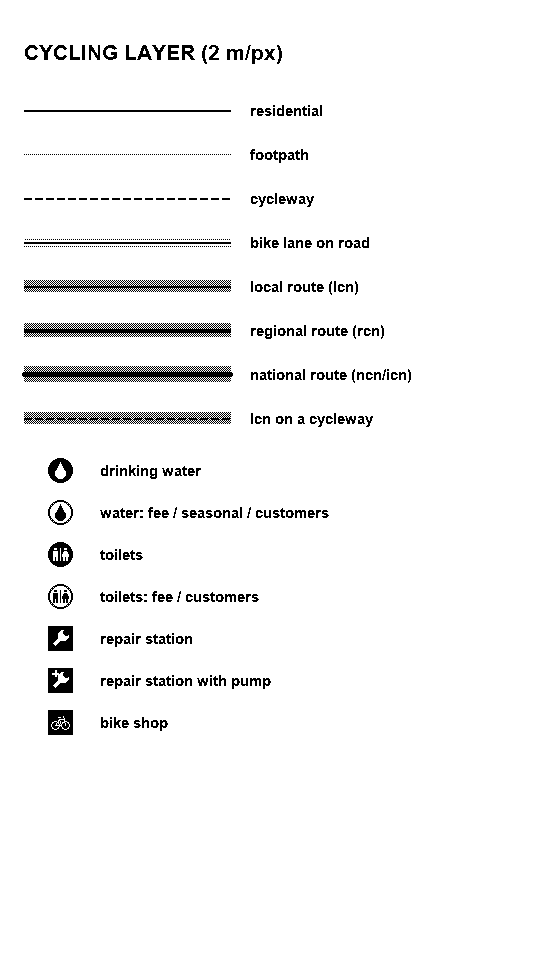
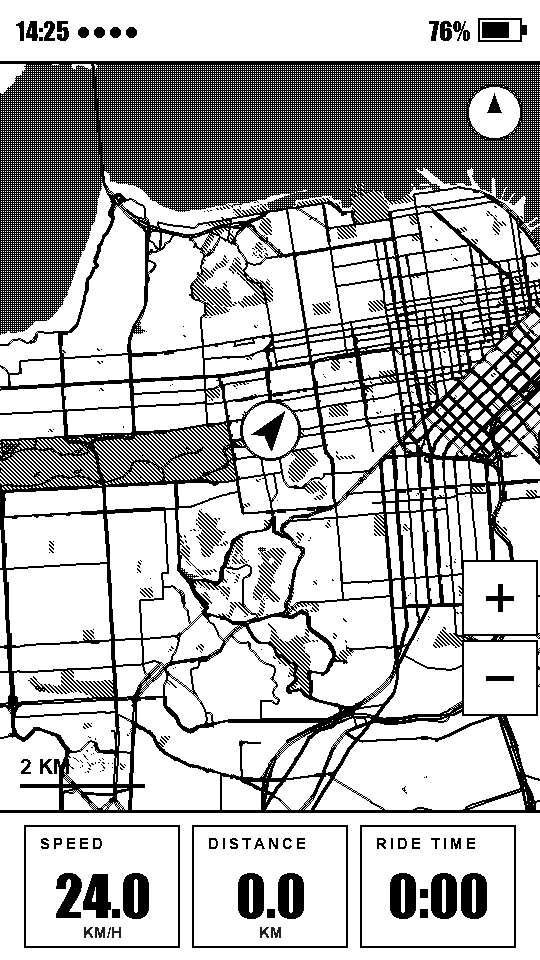
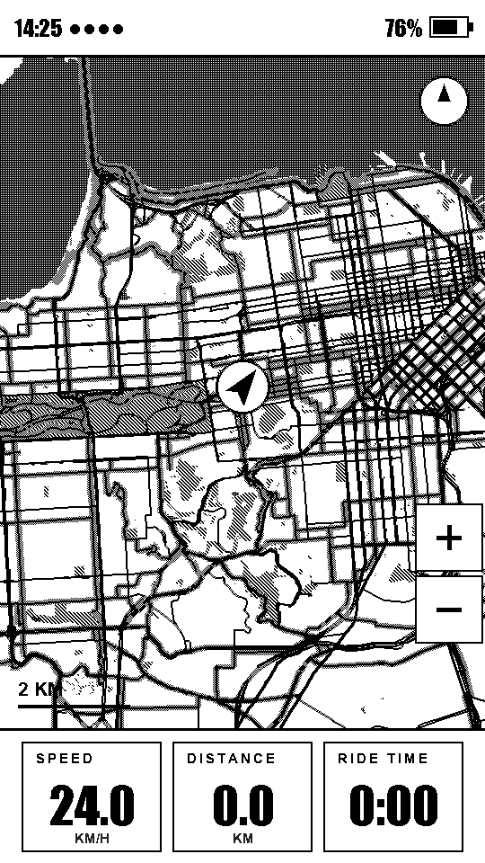
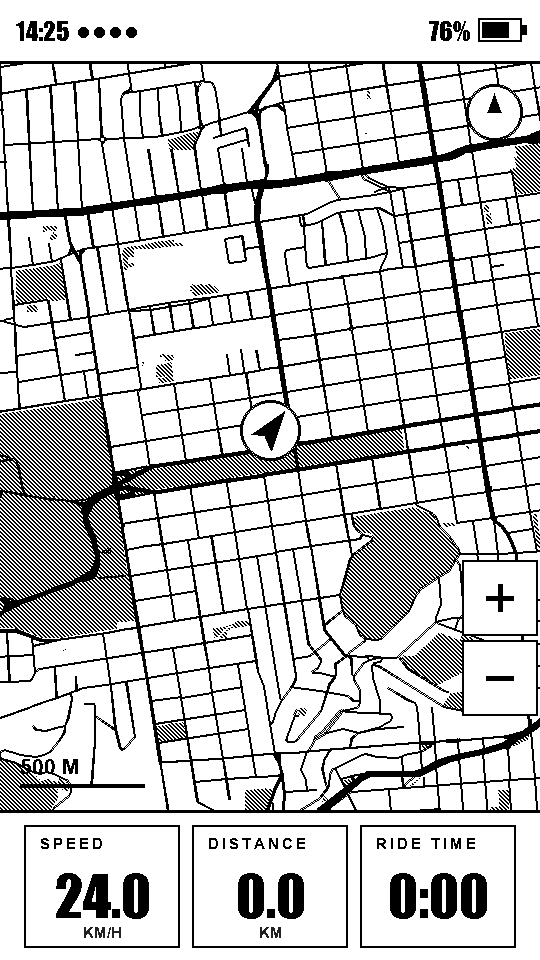
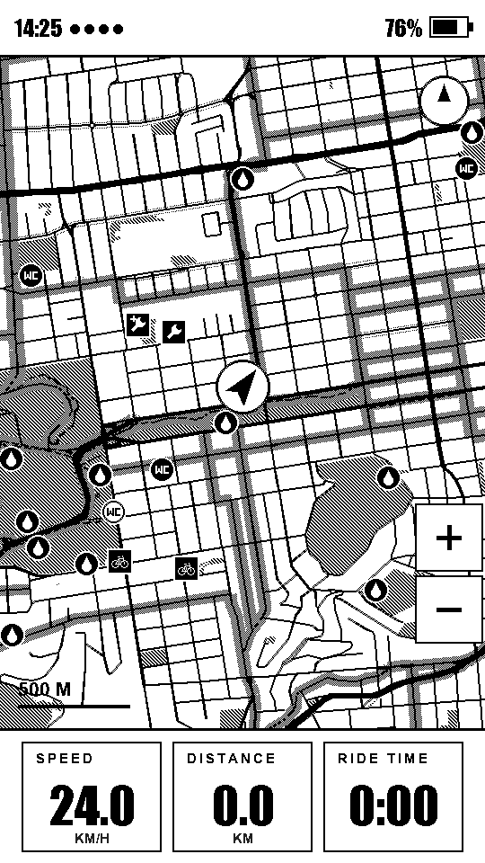
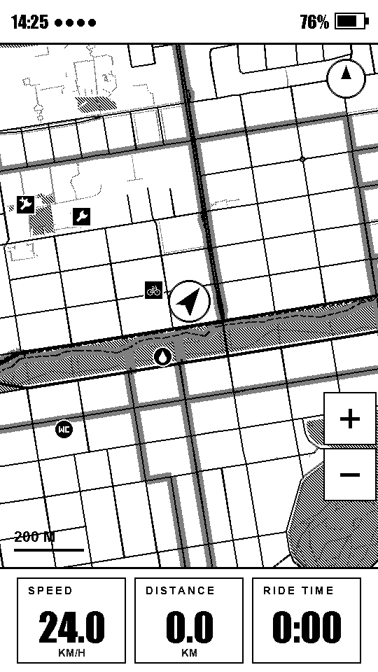
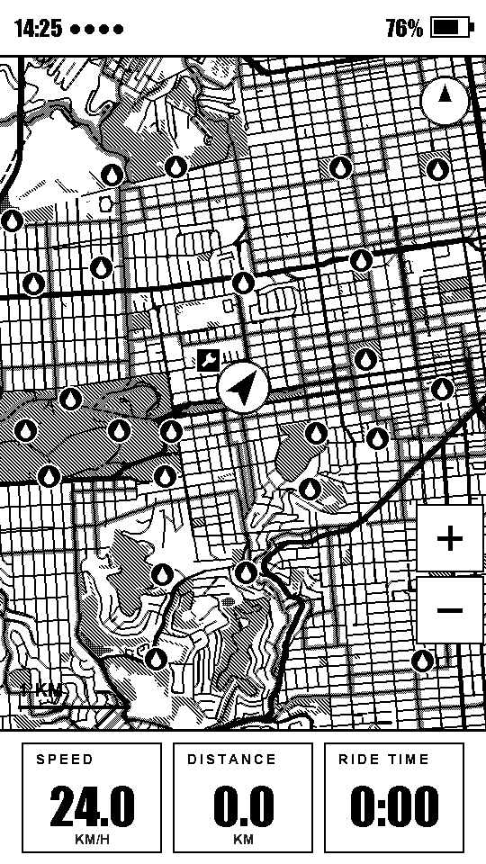
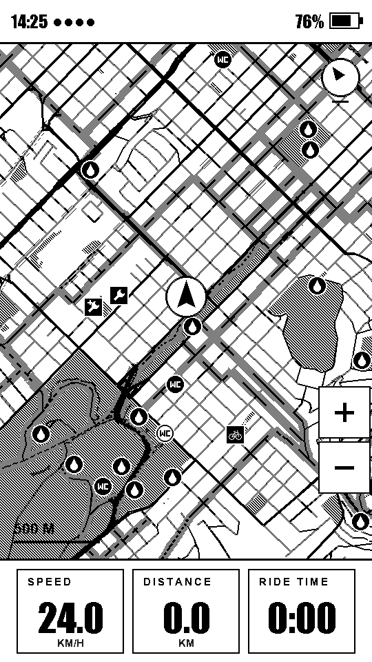
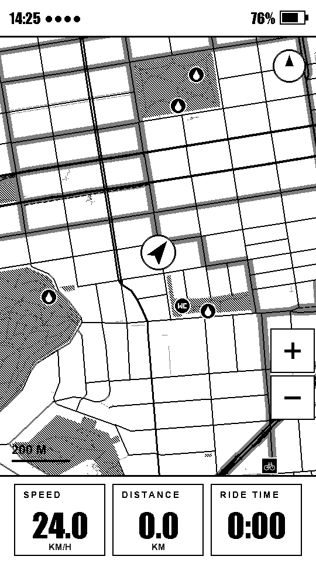

# Cycling POIs and bike routes on the device map

Status as of 2026-10-06. This is an investigation with a working prototype on
branch `feat/osm-pois-bike-routes`. The prototype covers the browser generator
(`docs/mapgen.js`), the tile format, the new per-tile `.poi` file, and the
firmware loader, projector and renderer. POIs are stored **outside** the map
files, in a `<h3>.poi` next to each `<h3>.ebm`. The bike-route flags stay
inside the `.ebm`.
The phone apps' builders (Swift and Kotlin) and `tools/maps/build_map.py` are
**not** ported yet (see section 6).

Goal: show the things a rider stops for (drinking water, toilets,
self-service repair stands, bike shops) as icons on the map, and draw OSM bike
infrastructure (signed bike routes, cycleways, painted lanes) so it reads
differently from ordinary roads. Both must stay readable on a 1-bit DU refresh.



## 1. How map data flows today

### Four generators, one format

There are four ports of the same builder, and each claims byte-for-byte
agreement with the others:

| Generator | Output | Who runs it |
|---|---|---|
| `tools/maps/build_map.py` | one whole-region `.ebm` (`data/sf.ebm`) | the developer; the original implementation |
| `docs/mapgen.js` + `mapgen-ui.js` | H3 res-6 tiles in a ZIP for the SD card | anyone, from the website |
| `companion-ios/Sources/MapBuilder.swift` | H3 res-6 tiles, sent over BLE | iOS app (the main path for riders) |
| `companion-android/.../map/MapBuilder.kt` + `OsmData.kt` | H3 res-6 tiles, sent over BLE | Android app |

The apps fetch Overpass once for the drawn region, then call `encodeTiles`
once per H3 cell. Each tile is a complete EBM2 blob over the cell's bounding
box, with an ELV1 elevation grid from Open-Meteo appended. Built tiles are
cached on the phone in `TileCache-v2`. Tiles the device already holds are
skipped by H3 id, and the rest stream to `map_store::saveTile` and are written
to `/maps/tiles/<first 6 of id>/<rest>.ebm`. The website does the same per
cell with `buildEbm(json, cellBbox)` but does not add ELV1.

### Overpass query (all four generators)

```
way[highway~^(motorway|trunk|primary|secondary|tertiary|residential|unclassified|
              living_street|pedestrian|cycleway|footway|path|track|steps)](bbox)
way[natural=water](bbox)        way[natural=coastline](bbox padded 0.35°)
way[leisure=park](bbox)         way[landuse~grass|forest|meadow|...](bbox)
way[natural~wood|scrub|grassland|heath](bbox)
out body; >; out skel qt;
```

The query fetches only ways. It fetches no nodes with tags and no relations.
The ways are classified as follows:

- `classify()` maps the highway tag to a road class: 0 motorway/trunk,
  1 primary, 2 secondary, 3 tertiary, 4 residential/unclassified/living_street/pedestrian,
  5 cycleway/footway/path/track/steps. Sidewalks and crossings are dropped, and
  `_link` is folded into its parent class.
- `highway=cycleway` therefore lands in class 5, next to footpaths. It is
  drawn as a faint 1 px dithered line and shed at 4 m/px and wider. Nothing
  else about cycling survives the build.
- Water and coastline become WTR2 polygons. Coastline is assembled into sea
  rings the osmcoastline way. Parks become PRK2 polygons.

### Encoding

The builder projects coordinates equirectangularly to metres from the grid
origin, then simplifies: RDP at 3 m for lines, and radial decimation at 3 m for
rings. Lines are cut into 0.02° sub-tiles with `i16` metre coordinates
relative to each sub-tile.

```
'EBM2' f64 lat0 lon0 tileDeg  i32 nx ny  index[nx*ny]{u32 off, u32 len}
sub-tile: u16 count, count × { u8 class, u16 n, n × i16 x,y }
[ELV1 grid] 'WTR2' polys  'PRK2' polys        (polys: u16 n, n × i16 x,y)
```

The format can represent:

- classed polylines (one byte of class, nothing else);
- two kinds of filled polygon;
- one elevation grid.

It cannot represent **points**, **attributes on a line**, names or labels.
Firmware reads PRK2 and then **stops**: it never looks past it. That is the
property the extension below relies on.

### Firmware

1. `map_select.h` picks the H3 cells covering the viewport, nearest first,
   with a budget of 64 tiles.
2. `map_store` loads tiles into a PSRAM LRU bounded by bytes (1 to 4 MB,
   released before an OTA).
3. `map_tiles::projectBlobInto` projects each tile into shared scratch, and
   sheds detail by zoom:
   - paths at 4 m/px and wider;
   - minor roads at 16 and wider;
   - secondary and tertiary at 32.

   Points within 2 px of each other are merged after projection. The scratch
   budgets are `MAX_POLYS` 24 000 and `MAX_POINTS` 80 000, and the polyline
   records are the binding one.
4. `map_view.cpp` draws the frame with 1-bit ink only (the DU refresh snaps
   grey to black or white). Road classes differ by width. Water is a 75% dot
   fill and parks a stripe fill, and both are recorded in the dither mask that
   the ghost settle-clean flashes. The zoom ladder is 1/2/4/8/16/32 m/px.

### Things found along the way (not caused by this work)

- **Parks overflow in a dense city.** `MAX_PARK_POLYS = 512` is at 100% in
  the San Francisco sweep. At 8 to 16 m/px, 1 500 to 2 200 park polygons per
  frame are dropped, so Golden Gate Park and the Presidio lose patches of
  hatching (`parks:` column in tilescene). The comment says the budget
  "predates the parks layer and has none to measure". This sweep has data to
  measure it now.
- **The host harnesses had bit-rotted.** `epd_compat.cpp` included
  `<esp_timer.h>` unconditionally (since #84 / #93), and `run_tilescene.sh`
  did not link `vfont.cpp` / `workout.cpp`. Both are fixed on this branch,
  because the screenshots below depend on them.
- **The main Overpass instance answers `406 Not Acceptable` to
  generic user agents** (curl's default, Node's `fetch`). The generators fell
  through to the mail.ru mirror each time. A request with an explicit
  `User-Agent: OpenTrailPaper/…` was served normally. Worth setting one
  deliberately in all three clients.

## 2. Design

### 2a. Storage: flags in the map, POIs beside it

Bike infrastructure is a property of a road line, so it stays in the `.ebm`
as a per-line flag. POIs are stored in their own file per tile. That lets
them be fetched, cached, sent and refreshed independently of the much larger
map tiles: a POI refresh is a few KB per tile instead of 50 to 250 KB.

**Way flags: a sub-tile trailer.** A sub-tile blob may end with exactly
`count` bytes, one `u8` of flags per polyline, in order:

| bits | meaning |
|---|---|
| 0–1 | bike-route network level: 0 none, 1 local (`lcn`, or no network tag), 2 regional (`rcn`), 3 national/international (`ncn`/`icn`) |
| 2 | dedicated cycleway: `highway=cycleway`, or path/footway/bridleway/track/pedestrian with `bicycle=designated` |
| 3 | painted lane or track on the road: `cycleway`, `cycleway:both`, `cycleway:left` or `cycleway:right` = `lane`, `track`, `opposite_lane` or `opposite_track` |
| 4–7 | reserved (`route=mtb`, unpaved surface, contraflow …) |

Old firmware reads `count` records and never looks at the bytes after them,
because the sub-tile's index length simply includes them. New firmware finds
the trailer by hopping the record headers (no point is read) and accepts it
only if exactly `count` bytes remain. A tile built before the trailer existed
always has 0 bytes left, so it cannot be mistaken for one. A trailer is
written only for sub-tiles where some polyline has a non-zero flag.

**Extension sections after PRK2 (reserved).** The layout is
`<4-byte magic><u32 byteLength><payload>`, and none is defined yet. New
firmware already skips any magic it does not know, by its length, so a future
in-map section never needs a firmware release to stay readable. Old firmware
stops at PRK2.

**POIs: `<h3>.poi`.** It sits in the same directory, with the same name, as
the tile: `/maps/tiles/<first 6 of id>/<rest>.poi`. Little-endian:

| offset | field |
|---|---|
| 0 | magic `EPOI` |
| 4 | `u8` version (1) |
| 5 | `u8` record size (6). A later version may append fields to each record, and a v1 reader skips them. |
| 6 | `u16` count |
| 8 | `u64` H3 cell this file belongs to (0 = not an H3 tile) |
| 16 | `f64` lat0, `f64` lon0: origin of x/y |
| 32 | `f32` kx, `f32` ky: metres per degree of longitude / latitude used for x/y |
| 40 | `count` records of `{u8 type, u8 flags, i16 x, i16 y}`, x/y in metres east/north of the origin |

- **Self-describing.** The header holds everything needed to place a POI;
  nothing is read from the `.ebm`.
- **Origin.** The builder uses the centre of the tile's bounding box, so i16
  metres cover ±32 km.
- **Empty files.** A file with zero records is valid and is still written. It
  says "POIs were built for this tile and there are none", which a later
  "does this tile have POI data?" check needs.
- **Missing files.** A missing file means no POIs.

| type | OSM | flags |
|---|---|---|
| 1 water | `amenity=drinking_water`; `man_made=water_tap` or `amenity=fountain` with `drinking_water=yes` | 0x80 restricted |
| 2 toilets | `amenity=toilets` | 0x01 also has drinking water, 0x80 restricted |
| 3 repair station | `amenity=bicycle_repair_station` | 0x01 pump, 0x02 tools, 0x04 chain_tool, 0x08 stand (`service:bicycle:*=yes`), 0x80 restricted |
| 4 bike shop | `shop=bicycle` | 0x01 pump, 0x02 repair/diy, 0x04 rental, 0x08 retail/parts, 0x10 second_hand, 0x20 ebike/charging |

"Restricted" means `fee=yes`, `access=customers`, or a `seasonal` tag other
than `no`. POIs tagged `access=private` or `access=no`, and water tagged
`drinking_water=no`, are dropped. A POI mapped as an outline (a toilet block
drawn as a building) is placed at the centroid of its vertices.

**Which tile a POI belongs to.** Each POI is stored only in the H3 cell that
contains it (`latLngToCell(lat, lon, 6) === cell`), not in every tile whose
bounding box covers it.

- **Why.** Neighbouring hexes' bounding boxes overlap. Under the
  bounding-box rule, 36% of the SF POIs were stored twice (800 records for
  588 POIs).
- **What it buys.** Exact membership needs no cross-tile de-duplication, and
  the nearest-POI search sees each POI once.
- **Overlap is still allowed.** A builder without an H3 library can fall back
  to the bounding box; that is `buildPoi`'s default when no `contains` test
  is passed. The projector still drops a POI of the same type within 1 px of
  one already placed.
- **Consequence.** A POI only shows when the tile containing it is on the
  card. POIs stop at the edge of the downloaded hexes, exactly like the roads.

**Rejected alternatives:**

- **High bits in the class byte.** Old firmware draws only classes 0 to 5, so
  a road on a bike route would *disappear* on an old device.
- **A separate route-overlay section with its own geometry.** It duplicates
  every route way (about 15% of road bytes in SF, against 5.8% for flags), and
  the overlay would never line up exactly with the road after the per-zoom
  decimation.
- **Bumping to EBM3.** Old firmware rejects the whole tile, and the apps skip
  tiles the device already has by id, so mixed-version devices would end up
  with blank holes.
- **POIs inside the `.ebm`.** An earlier version of this prototype stored
  them in a `POI1` section after PRK2. It worked and was invisible to old
  firmware, but it tied POI freshness to re-downloading the whole map tile.
  That version never shipped, so no `.ebm` with a `POI1` section exists in
  the field. Current firmware would simply skip one as an unknown section.

### 2b. Overpass additions

The website keeps one combined query (below). `buildEbm` takes the ways and
route flags from the response, and `buildPoi` takes the POIs. The apps are
meant to use **two** queries, so POIs can be refreshed on their own: the map
query with the route additions, and this small POI query:

```
[out:json][timeout:60];
( node["amenity"~"^(drinking_water|toilets|bicycle_repair_station)$"](bbox);
  node["man_made"="water_tap"]["drinking_water"="yes"](bbox);
  node["amenity"="fountain"]["drinking_water"="yes"](bbox);
  nwr["shop"="bicycle"](bbox);
  way["amenity"~"^(toilets|bicycle_repair_station)$"](bbox); );
out tags center;
```

`out center` has the server compute each outline's centre, so no geometry is
downloaded. For a 15 × 15 km box over San Francisco, the POI response was
180 KB, under 1% of the map query's response.

The combined query used by the website:

```
rel["route"="bicycle"](bbox)->.bk;
( …existing way clauses…
  way(r.bk)(bbox);                                   // route members the highway filter misses
  node["amenity"~"^(drinking_water|toilets|bicycle_repair_station)$"](bbox);
  node["man_made"="water_tap"]["drinking_water"="yes"](bbox);
  node["amenity"="fountain"]["drinking_water"="yes"](bbox);
  node["shop"="bicycle"](bbox);
  way["amenity"~"^(toilets|bicycle_repair_station)$"](bbox);
  way["shop"="bicycle"](bbox);
);
out body; >; out skel qt;
rel.bk["network"~"^(icn|ncn)$"]->.r3; way(r.r3)(bbox)->.w3;
make bikeroute level=3, ways=w3.set(id()); out;
… likewise rcn → level 2, and everything else → level 1
```

**Relation to way resolution happens on the server.** `out body` on the
route relations returns every member of a route that may cross a continent:
1.1 MB of JSON for central San Francisco (94 relations, 14 416 members).
Instead, three `make` statements return one derived element per network level
whose `ways` tag lists the member way ids inside the box. That is 28 KB for
the same area. The generator builds `wayId → max level` from those elements.

Route members that the highway filter does not fetch (service roads,
bridleways, busways) are pulled in by `way(r.bk)` and drawn as minor roads or
paths, so a route has no holes. Super-relations (EuroVelo parents) are not
walked: their stages carry `network=icn` themselves. MTB routes
(`route=mtb`) are left out for now.

### 2c. Rendering on 1-bit e-paper

**Bike routes** get a **flat 50% grey band** (a 1-px checker) centred under
the way and drawn beneath every road, so the road keeps its own weight on top
and the band shows as a halo either side.

- No other map element looks like it. The navigation route is solid or dashed
  black at 14 px, water is dots, and parks are stripes.
- The band's width carries the network level: 12/14/16 px up close, 6/8/10 px
  at 8 m/px and wider.
- It writes both colours, so over a park or water fill it still reads as a
  clean ribbon.
- It is 1-bit, so it survives DU, and it is added to the settle-clean dither
  mask like the other fills.

**Cycleways** are a 2 px dashed black line (7 on, 4 off) instead of the faint
footpath dither.

**Painted lanes** are a dotted 1 px line just outside each edge of the road
(like a lane line), drawn only at 4 m/px and closer.

**Shedding.** A flag can only ever keep more than the class rule would:

- regional and national routes never shed;
- local routes last to 16 m/px;
- cycleways last to 8 m/px.

So zoomed out to 16 m/px, where residential streets are gone, the bike
network is what remains. The before and after below are at 16 m/px:

| before (16 m/px) | after (16 m/px) |
|---|---|
|  |  |

**POIs** are 24 px icons with a 2 px white halo.

- **Shapes.** Circles mark comfort stops (a drop for water, "WC" for
  toilets). Squares mark bike service (a wrench for a repair stand, with a
  small "+" when it has a pump, and a bicycle for a shop).
- **Fill.** A solid black icon means free to use. A hollow icon means fee,
  customers only or seasonal.
- **Zoom.** All four types show at 4 m/px and closer. At 8 m/px only water and
  repair stands show, thinned to one per 48 px. None show at 16 m/px and
  wider.
- **Collisions.** Collisions are resolved greedily in priority order: repair,
  water, toilets, shop.
- **Overlaps.** Icons are skipped where the compass, zoom buttons, scale bar,
  nav banner or rider marker would cover them.
- **Order.** Icons are drawn over the navigation route, because a water stop
  beside the line being ridden is exactly the one that must not vanish.

| before (4 m/px) | after (4 m/px) |
|---|---|
|  |  |

| 2 m/px | 8 m/px | track-up 4 m/px | the Wiggle, 2 m/px |
|---|---|---|---|
|  |  |  |  |

### 2d. Interaction

None for now. The prototype had a "nearest water" chip in the map's top-left
corner (distance and an arrow to the closest `amenity=drinking_water` among
the cached `.poi` files); it was removed at the user's request. The `.poi`
files are enough to bring back a lookup like that later, or a "next water
along the route" field.

## 3. Cost

Measured on 7 H3 tiles over central San Francisco (a dense worst case: 588
POIs and a lcn grid on most streets). Tiles were built from the same Overpass
response with `cycling: false` (byte-identical to today's builder) and with
`cycling: true`.

| | today | with cycling | delta |
|---|---|---|---|
| `.ebm` bytes | 1 078 329 | 1 143 261 | **+64.9 KB (+6.0%)** |
| — way-flag trailers | – | 62 035 | +5.75% |
| — extra route-member geometry | – | ~2 900 | +0.27% |
| `.poi` bytes (7 files, 588 POIs) | – | 3 808 | +0.35% of the map |
| `.poi` if POIs were kept per bounding box | – | 5 080 (800 records) | |
| road records | 61 979 | 62 194 | +0.35% |
| scratch peak, road polys (5 070-frame sweep) | 16 487 / 24 000 (69%) | 18 887 (79%) | +10 pts |
| scratch peak, road points | 36 669 / 80 000 | 42 573 | |
| scratch peak, POIs | – | 107 / 256 | |
| PSRAM | | +1.5 KB POI scratch, plus each cached tile's `.poi` (a few KB, counted in the cache's byte budget). `MapPolyline` stays 12 B on ESP32 (`flags` fits in the padding after `cls`). | |
| internal RAM | | +512 B: `CachedTile` grows by a pointer and a length, across 64 slots | |
| SD access | | one `SD.exists` per tile load (plus a small read when the file is present), never per frame | |
| Overpass response | 29.18 MB | 29.38 MB | +0.7% |
| Overpass time (same box, overpass-api.de) | 8.7 s | 9.2 s / 16.4 s | within this server's run-to-run variance |

**Size.** The trailer is the main cost, at one byte per polyline in any
sub-tile with a flagged way, which in SF is nearly all of them. Packing it
into nibbles would halve it to about 2.9%, at the price of 4 spare bits. A
rural tile pays far less, because sub-tiles with no flagged way carry no
trailer.

**Render time.** These are host timings (Apple silicon, µs, north-up),
measured before the POIs moved to `.poi` files. The move changed where the
records are read from, not what is drawn, and a re-run on the regenerated
tiles gave the same numbers within noise.
Absolute numbers mean nothing for the ESP32, but the ratio carries over
roughly:

| m/px | project today → cycling | draw today → cycling |
|---|---|---|
| 2 (track-up) | 168 → 178 | 1 123 → 1 791 (+59%) |
| 4 | 351 → 339 | 1 857 → 2 703 (+46%) |
| 8 | 443 → 496 | 2 667 → 3 900 (+46%) |
| 16 | 481 → 550 | 2 484 → 4 687 (+89%) |
| 32 | 497 → 531 | 1 355 → 2 162 (+60%) |

Projection barely moves. Drawing grows, and most of the growth is the band
fill, which writes every covered pixel through `epd_draw_pixel` with its
per-pixel rotation. In dense SF, 16 m/px is the worst case, because local
routes outlive the residential streets they run on. Band joints are already
skipped when the band is 8 px or narrower. Next levers if device timing shows
a problem:

- drop lcn bands at 16 m/px;
- a span writer for the checker (the panel is rotated, so an app-space row is
  a native column, but the work is still a tight loop);
- draw the far-zoom band as two dithered lines.

**Overpass load.** The additional clauses are indexed tag and bbox lookups.
The `make` statements resolve relation membership server-side, which costs
less than shipping relation bodies.

## 4. Backward compatibility (verified)

| | old tiles | new tiles |
|---|---|---|
| **old firmware** | today | renders as today: the trailers are never read and `.poi` files are never opened. Route-member service roads appear as minor roads (+0.4% polys). See `oldfw_newtiles_mpp04.png`, rendered by the firmware sources of `dd63d43`. |
| **new firmware** | pixel-identical to old firmware at every zoom (checked with `cmp` on the rendered PNGs) | full cycling layer; a missing `.poi` just means no icons |

The device's tile listings (which the app uses for its "already on the
device" check) match only `.ebm` names, so `.poi` files do not confuse them.

The apps need more work when they are ported:

- **Map cache.** Each phone keeps a `TileCache-v2`, and the device skips
  tiles it already has by id. A rider therefore keeps the tiles already on
  the card until they are rebuilt and re-sent. The map cache should move to
  `TileCache-v3` (for the flags).
- **POI cache.** `.poi` files want a cache of their own, with a shorter
  refresh period.
- **Existing cards.** Getting the flags onto them needs a decision
  (section 7). POIs do not, because a `.poi` can be sent on its own next to a
  tile that is already there.

**Sending a `.poi` from the app needs no new BLE protocol.** `saveTile`
recognises the `EPOI` magic and writes the bytes to `<id>.poi` instead of
`<id>.ebm`. It then drops the cached tile, so the next frame reloads both
files. The app can push POIs through the existing tile transfer, with the
same tile id.

## 5. What the prototype covers

Built and exercised end to end on this branch:

- **Generator.** `docs/mapgen.js` (the website builder; it builds the same H3
  tiles as the apps):
  - the Overpass additions;
  - `wayFlags()` and `poiOf()`;
  - the route-member fallback class;
  - sub-tile trailers in `buildEbm`;
  - `collectPois()` and `buildPoi()`, which write the `.poi` file;
  - `mapgen-ui.js` puts a `.poi` next to each `.ebm` in the SD-card ZIP,
    with exact H3 membership, and `setup.html` / `setup-files.js` describe
    the file.

  `buildEbm(json, {cycling: false})` reproduces today's bytes exactly. With
  cycling on, the `.ebm` differs from today's only by the trailers and the
  extra route-member ways.
- **Firmware.**
  - `map_tiles.cpp`:
    - trailer detection, flag-aware shedding, and the generic
      extension-section skip loop;
    - for `.poi` files: `poiFileValid()`, `projectPoisInto()` (zoom filter,
      de-duplication) and `forEachPoi()`.
  - `map_store.cpp`:
    - `ensureTileLoaded` reads `<id>.poi` in the same visit as `<id>.ebm`,
      into the same cache slot, with the same lifetime and eviction;
    - `renderInto` projects the `.poi` after the tile;
    - `saveTile` accepts `.poi` files.
  - `map_view.cpp`: bands, cycleway and lane styles, POI icons with collision
    and chrome avoidance.
  - `pio run -e t5s3-painter` builds: RAM 38.7%, flash 16.4%.
- **Tools.**
  - `tools/maps/ebm_info.py`: per-section byte breakdown of tiles and `.poi`
    files.
  - `tools/map_test/tilescene` now:
    - loads the `.poi` files beside the tiles;
    - reports flagged polylines, POIs, host project/draw µs and the POI peak
      in the sweep.
- **Screenshots.** `investigations/img/osm-pois-bike-routes/`.

To reproduce, build tiles with `buildEbm` and `buildPoi` per H3 cell into a
directory (as `mapgen-ui.js` does), or unzip the website's ZIP. Then:

```
tools/map_test/run_tilescene.sh <tiledir> <outdir> 37.7735 -122.447
TILESCENE_SWEEP=1 tools/map_test/tilescene <tiledir> /tmp
python3 tools/maps/ebm_info.py <tiledir>
```

## 6. What is left

1. **Port the builder to Swift and Kotlin** (the path riders actually use),
   plus `build_map.py`. Android's streaming parser in `OsmData.kt` keeps only
   a few way tags. It needs:
   - node tags, and `amenity`/`shop`/`access`/`fee`/`seasonal`/`drinking_water`
     on ways;
   - `bicycle`, `cycleway*` and `service:bicycle:*`;
   - the derived `bikeroute` elements.

   Add a fixture test so all ports produce identical bytes for one Overpass
   response (`FormatTest.kt` is the natural home). Bump `TileCache-v2` to
   `-v3` in both apps.
2. **POIs in the apps.** This needs:
   - the separate POI query (section 2b);
   - a `.poi` cache keyed by tile id;
   - sending `.poi` files through the existing tile transfer, both with new
     tiles and on their own for tiles already on the card.

   The device can already store and draw them.
3. **On-glass checks.** Draw time at 8 and 16 m/px on the device. Whether the
   checker band ghosts under DU: it is in the settle-clean mask, but it is the
   first 1-px 50% pattern on the map. Legibility of the 1 px lane dots in
   daylight.
4. **Regenerate `data/sf.ebm`** (the whole-map sample) with the new builder
   once `build_map.py` is ported. Whole-region maps (`/maps/*.ebm`) do not
   load a `.poi` yet. Loading a `<name>.poi` beside them would be a few lines
   in `loadFile`.
5. **Raise `MAX_PARK_POLYS`.** This is independent of this work but was found
   by it.

## 7. Open decisions

- **Getting the bike-route flags onto existing devices.** Tiles already on
  the card have no flags until they are re-sent. POIs are not affected: the
  app can send `.poi` files for tiles that are already there. Options:
  - the app re-sends every tile once after the update. This is simple, but it
    means megabytes over BLE;
  - the device reports which tiles lack the flags, and the app offers
    "update maps";
  - do nothing: new downloads get the flags and old ones age out.
- **How the app learns which tiles have POIs.** The device's tile listing
  returns only `.ebm` ids. Either add a `.poi` listing (one more directory
  scan), or have the app track what it has sent.
- **POI refresh policy.** How often should the app rebuild `.poi` files?
  Water points and repair stands change more often than roads. Should it
  refresh them automatically while the phone is connected?
- **Default on or off.** Should the layer be a setting? Some riders will find
  the bands busy in a dense city at 8 m/px. Possible toggles: POIs, bands.
- **Which POIs.** Also include `amenity=bicycle_rental` / bike share, cafés,
  or `amenity=compressed_air` (pumps at fuel stations)? Each is one more
  type id. Should shops appear at all, or only shops that offer repair or a
  pump?
- **Which routes.** Should `route=mtb` be a separate flag bit with its own
  style? Should untagged-network `route=bicycle` relations count as local (as
  now)? In some places these are mapper-local loops, not signed routes.
- **Nibble-packed trailer.** Halves the trailer cost (the map grows by about
  3.1% instead of 6.0%) but leaves no spare flag bits. Recommendation: keep a
  byte.
- **Zoom rules and icon size.** The thresholds in `shedAtZoom` / `poiAtZoom`
  and the 24 px icons are first guesses, tuned only on SF screenshots.
